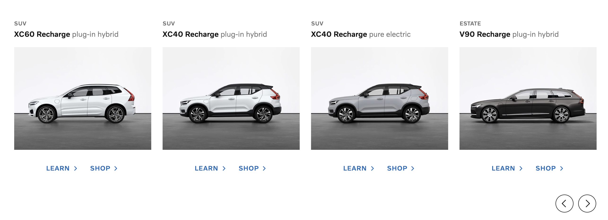

# Desafio Frontend - Volvo Cars

Este projeto é uma solução para o desafio de frontend web proposto pela Volvo para a vaga de desenvolvedor frontend. O desafio consistia em criar uma lista de cards com informações sobre carros da Volvo, com a funcionalidade de navegação entre os cards. Foi desenvolvido usando Next.js com TypeScript.

Veja o projeto em ação [aqui](https://link-do-deploy-da-sua-aplicacao.com).

### Desktop



### Mobile


## Como Executar o Projeto Localmente

Siga as etapas abaixo para executar este projeto localmente:

1. Clone o repositório do GitHub:

```bash
  git clone https://github.com/adrianmouzinho/frontend-challenges.git
```

2. Navegue até o diretório do projeto:

```bash
  cd frontend-challenges/god-frontend-code-test
```

3. Instale as dependências:


```bash
  npm install
```

4. Inicie o servidor de desenvolvimento:

```bash
  npm run dev
```

5. Abra seu navegador e acesse [http://localhost:3000](http://localhost:3000) para visualizar a aplicação.

## Recursos e Tecnologias Utilizadas

- Next.js
- TypeScript
- CSS
- VCC-UI

## Descrição do Desenvolvimento

Neste projeto, utilizei a biblioteca de componentes [VCC-UI](https://vcc-ui.vercel.app/) da Volvo para criar uma experiência de usuário consistente e atrativa. A VCC-UI oferece um conjunto de componentes prontos para uso que se integram perfeitamente ao design dos produtos da Volvo. Alguns dos componentes VCC-UI que foram utilizados incluem: Text, Flex, Link, Row, Spacer e IconButton. Essa biblioteca, no entanto, apresentou vários problemas durante o desenvolvimento do projeto.

Este README fornece um guia básico para a compreensão do projeto. Não hesite em explorar o código-fonte para obter mais detalhes sobre a integração da VCC-UI e outros aspectos do desenvolvimento.

## Licença

Este projeto é licenciado sob a Licença MIT.